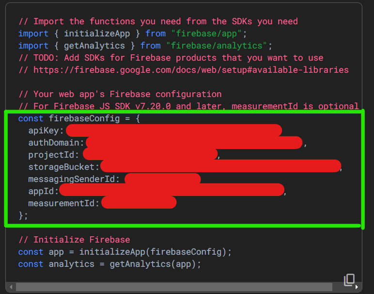
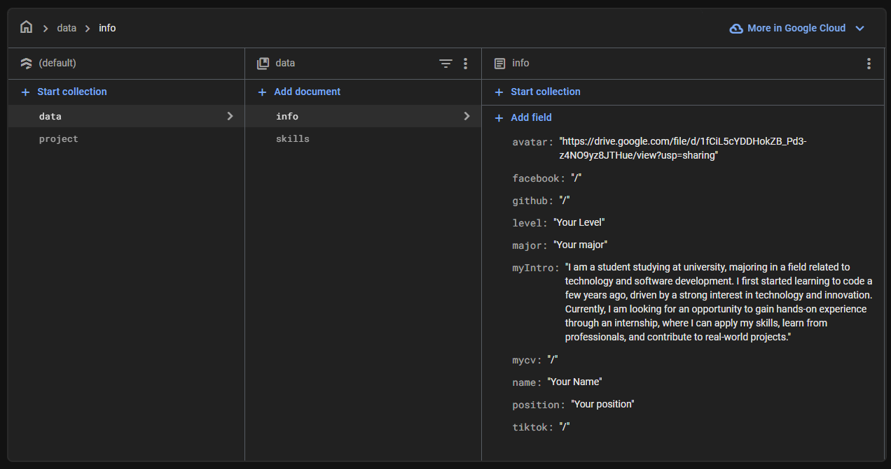
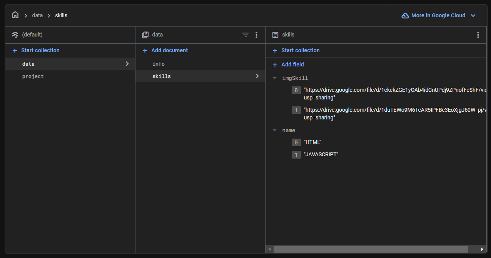
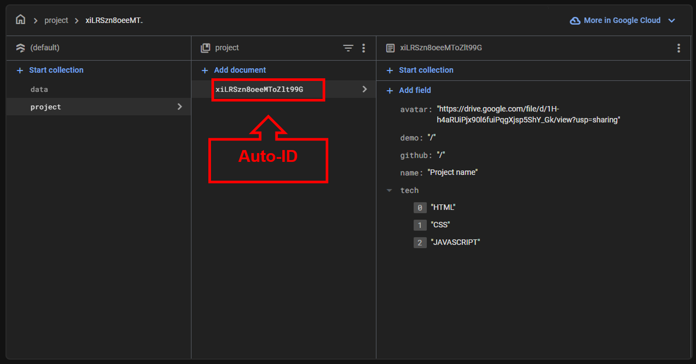

# PORFOLIO - HỒ SƠ CÁ NHÂN

### CÔNG NGHỆ SỬ DỤNG
- HTML
- CSS
- JAVASCRIPT
- REACTJS ( Framer motion )
- Firebase ( Firestore )
- Vercel

### Đường dẫn trang web
Ứng dụng demo: [Porfolio]

### Hướng dẫn
**Bước 1**: Clone dự án.
```bash
git clone https://github.com/duy08k4/MyPortfolio_Project.git
```

**Bước 2**: Tạo Firebase Project và tạo Firestore Database.
- Xem hướng dẫn [tại đây](https://www.youtube.com/watch?v=8DYWeI4Yc8Q).

**Bước 3**: Thiết lập Firebase cho Portfolio.
- Mở Firebase Console > Project settings. Sau đó lấy thông tin **config** của project.
 
- Quay lại thư mục dự án tạo file **.env** cùng cấp với thư mục **src**. Tạo các biến môi trường và nhập thông tin **config** đã lấy được. Các Biến môi trường bao gồm:
    - **REACT_APP_KEY_APIKEY=**< config >
    - **REACT_APP_KEY_AUTHDOMAIN=**< config >
    - **REACT_APP_KEY_PROJECTID=**< config >
    - **REACT_APP_KEY_STORAGEBUCKET=**< config >
    - **REACT_APP_KEY_MESSAGINGSENDERID=**< config >
    - **REACT_APP_KEY_APPID=**< config >
    - **REACT_APP_KEY_MEASUREMENTID=**< config >

**Bước 4**: Cấu trúc dữ liệu trong Firestore:




**Bước 5**: Chạy dự án
```bash
npm run i-packages
```